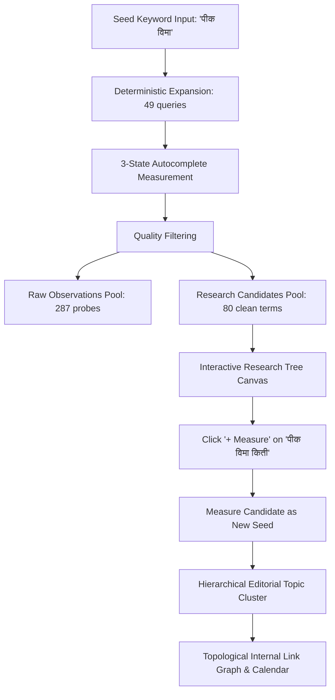

# Praman (प्रमाण) — Launch Presentation & Commercial Pitch

> **"Evidence-First Keyword Demand for Regional India & English. Refusing to Fake Search Volume."**

---

## Executive Summary

**Praman** (प्रमाण — Sanskrit/Marathi for *evidence, proof, standard*) is an evidence-first keyword demand and editorial content planning platform built specifically for Indian regional-language publishers, SEO freelancers, and digital media teams.

Today, over 500 million active internet users in India consume content in regional languages (Marathi, Hindi, Tamil, Telugu, Bengali, Gujarati, Kannada, Malayalam, Punjabi, Odia) and regional English. Yet, the entire $70B global SEO toolchain (Ahrefs, Semrush, Google Keyword Planner) fails them:
1. **Google Keyword Planner** returns "0–10" or empty tables for regional-script queries.
2. **Global SEO Suites** ($129+/month) rely on Latin-centric scraping databases that hallucinate zero volume or force English transliterations.
3. **No Commercial Tool** respects the grammatical syntax, combining vowel signs (matras), or SOV question patterns of Brahmic scripts.

Praman solves this by turning Google's keyless autocomplete protocol into a **mathematically rigorous, transparent demand index** ($0.0 \le \text{demand}(s) \le 1.0$), combined with a **human-in-the-loop SERP evaluation** and a **topological content calendar**. It does so while adhering to one inviolable rule: **missing measurement is never zero.**

---

## Part I: The Market Opportunity & The Problem

### 1. The 500M+ Regional Language Content Void
- India’s internet user base has crossed **800 million**, with over **65% accessing the web predominantly in non-English Indian languages**.
- Digital ad spend in regional content is growing at **32% CAGR**, driven by BFSI (crop insurance, micro-loans), government schemes (PM-Kisan, DBT), agriculture, health, and local commerce.
- Despite this immense demand, regional-language creators have **zero reliable tooling** to plan their quarterly editorial content.

### 2. Why Incumbents Fail in India
| Incumbent Tool | Regional Language Experience | Why It Fails |
|---|---|---|
| **Ahrefs / Semrush** ($129–$249/mo) | Empty results or English romanised strings | Built on historical clickstream databases that lack Indian regional clickstream panels. |
| **Google Keyword Planner** | "0 – 10 searches/mo" for viral local queries | Designed to sell Ads; excludes keywords with low commercial PPC competition even if search intent is massive. |
| **Ubersuggest / Free Scrapers** | Flaky, English-only modifiers ("what is", "how to") | Fails completely on Indian SOV (Subject-Object-Verb) grammar where interrogatives sit sentence-final or inflected. |
| **Manual Google Browsing** | 20 open tabs, typing "शेती क", copy-pasting to Excel | Slow, unquantified, non-reproducible, and exhausting for content creators. |

### 3. The Unaddressed User: The Regional Creator & Freelancer
- **Primary Persona**: The regional blogger/publisher writing in Marathi, Tamil, Hindi, or Telugu about agriculture, government schemes, tech, or finance.
- **Secondary Persona**: The regional SEO freelancer who manages 5–10 regional SME websites and needs justifiable data to propose content roadmaps to clients.
- **Enterprise Persona**: Regional newsrooms (Lokmat, Sakal, Daily Thanthi, Eenadu) deciding editorial commissions and newsroom resource allocation.

---

## Part II: The Praman Difference — Philosophical & Mathematical Moat

### 1. The Core Invariant: Missing Measurement is Never Zero
Most keyword tools hide network errors, rate limits, or empty sets behind arbitrary zeros or fabricated averages. Praman enforces a strict 3-state codomain:
$$V = \mathbb{R} \cup \{\bot\}$$

| State | Mathematical Representation | Meaning | Praman Action |
|---|:---:|---|---|
| **Measured Absence** | $0.0$ | Successfully fetched; Google returned empty suggestions | Scored as verified zero demand |
| **Unmeasured** | $\bot$ (`None`) | HTTP 429, timeout, network failure | Excluded from denominator; flagged as partial |
| **Never Asked** | $\bot$ (`None`) | Run budget cap reached before query could be issued | Reported separately as budget truncation |

### 2. Transparent, Pinned Scoring (No Moving Denominators)
Praman refuses to renormalize surviving weights when a voice fails. If an axis is unmeasured, the measured mass $c(s) < 1.0$, which caps the achievable score and guarantees full reproducibility:
$$\text{demand}(s) = 0.50 \cdot \text{breadth}(s) + 0.25 \cdot \text{coverage}(s) + 0.15 \cdot \text{density}(s) + 0.10 \cdot \text{depth}(s)$$

```
Example: Seed 'शेती' (Marathi Agriculture)
- Breadth:  1.000 × 50% = 0.500
- Coverage: 1.000 × 25% = 0.250
- Density:  0.167 × 15% ≈ 0.025
- Depth:    1.000 × 10% = 0.100
───────────────────────────────
Total Demand Score:      0.875 (Strong Evidence)
```

### 3. Product Calibration: "Evidence Bands", Not False Guarantees
Praman does not sell "guaranteed traffic" or "search volume". It provides **Demand Evidence Bands**:
- 🟢 **Strong Evidence ($\ge 0.50$)**: High multi-axis expansion yield, prominent rank position, or heavy question density.
- 🟡 **Moderate Evidence ($0.25 \text{ to } 0.49$)**: Measurable autocomplete footprint across partial expansion axes.
- ⚪ **Weak Evidence ($< 0.25$)**: Sparse expansion surface; niche or emerging query.
- 🔴 **Insufficient Evidence ($\bot$)**: Unmeasured due to connection or budget failure; never punished as zero.

### 4. Raw Observations vs. Filtered Research Candidates
Autocomplete probes generate raw probing artifacts (e.g., `पीक विमा क` from consonant tests). Praman preserves data integrity by distinguishing:
- **Raw Observations**: The complete, unfiltered audit trail of everything measured.
- **Research Candidates**: Clean, quality-filtered search terms ready for editorial action (e.g., `पीक विमा 2026`, `पीक विमा किती`, `पीक विमा pdf`).

---

## Part III: The Research Loop & Product Workflow

Praman transforms passive keyword discovery into an active, continuous research loop:



### 1. Interactive Research Tree Canvas
- Hierarchical tree visualization with full horizontal and vertical scroll containment.
- One-click `[+ Measure]` button on every candidate to trigger child research runs.
- Instant branch filtering and seed isolation.

### 2. Intent Evidence Diagnostic
- When a query lacks explicit markers, Praman flags it as **`unclear`** rather than fabricating an "informational" label.
- Clicking the badge opens the **Intent Diagnostic Modal**, which inspects real autocomplete expansion evidence across 5 buckets:
  1. 📅 **Freshness**: `2026`, `latest`, `नवीन`
  2. 💳 **Transactional**: `pdf`, `online`, `अर्ज`, `यादी`
  3. 🛠️ **How-To**: `कसे`, `how to`, `पद्धती`
  4. ❓ **Questions**: `काय`, `किती`, `what is`
  5. ⚖️ **Comparison**: `vs`, `तुलना`, `फरक`

### 3. Human SERP Competition Banding
- Refuses to scrape SERPs (preventing ToS violations and IP blocking).
- Prompts a human researcher to glance at the top-10 results and record 3 qualitative facts:
  1. *Are weak/forum domains ranking in top 5?*
  2. *Are top results thin or low effort?*
  3. *Are top results stale or outdated?*
- Derives rigorous **Low / Medium / High** competition bands only when $\ge 2$ observations are present.

### 4. Editorial Content Calendar & Internal Linking
- Groups cross-script keywords into unified semantic topic clusters via phonetic consonant skeleton keying.
- Generates a prioritized publishing calendar with recommended article shapes (Explainer, Guide, Comparison, News).
- Produces a cycle-free internal linking graph with specific anchor texts.

---

## Part IV: Commercial Model & Unit Economics

### 1. Unit Economics: Why Praman is 95%+ Gross Margin
- Devanagari seed = **49 queries**. Latin/English seed = **42 queries**.
- Autocomplete endpoints are keyless, lightweight HTTP calls requiring **no paid third-party APIs** (no DataForSEO, no SerpApi, no OpenAI token spend for core scoring).
- Compute cost per 1,000 keyword evaluations: **< ₹0.80 ($0.01 USD)**.

### 2. Pricing Architecture

| Tier | Price | Monthly Query Quota | Estimated Seeds/Month | Target Persona | Features |
|---|---|:---:|:---:|---|---|
| **Community (Free Beta)** | ₹0 | 250 | ~5 seeds | Regional Bloggers, Solopreneurs | Full 4-axis demand scoring, 11 languages, Evidence Banding, CSV export, Research Tree. |
| **Pro** | **₹399 / mo** (or ₹3,499 / yr) | 2,500 | ~50 seeds | Professional Freelancers, Full-time Bloggers | Content Calendar, Internal Link Graph, Score History Tracking, Markdown Reports, Priority Expansion. |
| **Studio / Agency** | **₹1,499 / mo** | 12,500 | ~250 seeds | Regional Newsrooms, Content Agencies | Batch multi-seed runs, Custom taxonomy export, REST API access, Multi-user support. |

### 3. Price-to-Value Comparison
- **Ahrefs Lite**: $129/mo (~₹10,700/mo) $\to$ Fails on Indic scripts, returns 0 rows.
- **Praman Pro**: ₹399/mo ($4.80/mo) $\to$ 100% accurate Indic & English demand evidence, tailored to regional syntax.

---

## Part V: Go-To-Market (GTM) & Launch Strategy

### Phase 1: The "20 Regional Bloggers" Alpha/Beta (Weeks 1–4)
- **Goal**: Direct qualitative feedback and content validation.
- **Action**: Hand Praman to 20 active Marathi, Tamil, Telugu, Hindi, and English agricultural/tech bloggers.
- **Focus**: Observe how they use the `[+ Measure]` candidate loop to generate article clusters. Refine thresholds based on real editorial output.

### Phase 2: Open Beta & Organic Distribution (Weeks 5–10)
- **Distribution Channels**:
  - Regional blogger WhatsApp / Telegram communities and Facebook creator groups.
  - Dedicated Marathi/Tamil/Hindi video walkthroughs showing: *"How I found 80 uncompeted Marathi article ideas in 2 minutes without Ahrefs"*.
  - Free report generator tool: Public web dashboard allowing 3 free seed measurements without signup.

### Phase 3: Commercial Monetization (Week 11+)
- Introduce Pro tier (₹399/mo) with Content Planning, Internal Linking, and Markdown exports.
- Form partnerships with regional digital marketing institutes and creator programs.

---

## Part VI: 10-Slide Pitch Presentation Deck

### Slide 1: Title & Hook
**Praman (प्रमाण)** — The Evidence-First Keyword Demand Engine for Regional India  
*“Over 500 million Indians search in regional languages. Every major SEO tool shows them zero.”*

### Slide 2: The Multi-Million User Blindspot
- 500M+ Indians search online in regional scripts daily.
- Global tools ($129/mo) show zero rows or force English transliteration.
- Google Keyword Planner hides non-commercial editorial queries.
- Creators resort to manual typing across 20 browser tabs.

### Slide 3: The Solution
- Systematic, mathematical approach to Google autocomplete.
- Deterministic 4-axis expansion (Alphabet, Modifiers, SOV Interrogatives).
- 3-State Truth: Measured Absence vs. Unmeasured vs. Never Asked.
- Automated Content Calendar & cycle-free Internal Link Graph.

### Slide 4: The Mathematical Moat
- Refusing to fake search volume or CPC numbers.
- Pinned voice weights ($0.50$ Breadth, $0.25$ Coverage, $0.15$ Density, $0.10$ Depth).
- Measured mass $c(s)$ tracking without weight renormalization.

### Slide 5: Product Calibration & The Loop
- Evidence Bands (Strong, Moderate, Weak, Insufficient) replacing arbitrary priority flags.
- Clean separation of Raw Observations vs. Actionable Research Candidates.
- The `[+ Measure]` loop: turning one seed into an entire cluster of validated content opportunities.

### Slide 6: Linguistic Intelligence
- Indian SOV question grammar awareness.
- Combining character matra boundary protection in Unicode regex.
- Phonetic consonant skeleton keying for bilingual clustering (`मराठी शेती` $\leftrightarrow$ `marathi sheti`).
- 11 languages supported out of the box (10 Indic + English).

### Slide 7: Live Validation
- Live run results: `शेती` (0.875 demand, 81 candidates), `पीक विमा` (0.844 demand, 80 candidates), `crop insurance` (0.839 demand, 109 candidates).
- 100% reproducible score breakdowns.

### Slide 8: 95%+ Gross Margin Architecture
- Zero-dependency Python standard library core.
- No costly SERP proxies, scraping meshes, or AI token overhead.
- Unit cost: < ₹0.80 per 1,000 keyword evaluations.

### Slide 9: India-First Monetization
- Community Free Beta (250 queries/mo) for viral adoption.
- Pro @ ₹399/mo (Quarterly content plans, internal linking graph).
- Studio @ ₹1,499/mo (Agencies, batch runs, API).

### Slide 10: The Ask & Launch
- Roll out to first 20 regional bloggers.
- Measure content production speed and cluster coverage.
- Launch the public free beta.
