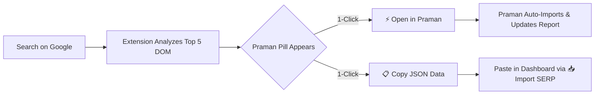

# 🧭 Praman SERP Companion — Chrome Extension (Manifest V3)

> **Zero-Labor Indic & English SERP Intelligence without violating Google Terms of Service.**

---

## ⚡ The Problem & The Solution

In traditional SEO, gathering competition signals (whether top ranking pages are forums, outdated, or thin) requires repetitive, tedious human labor—or illegal, bot-detected headless scrapers that risk IP bans.

**Praman SERP Companion** solves this with an elegant, 100% TOS-compliant architecture:
- **Zero Headless Bots**: Operates entirely client-side inside your own active browser tab.
- **Zero Captchas or Proxies**: You search Google naturally as a human user; the extension inspects the rendered DOM in real time.
- **Deterministic Mathematical Alignment**: Extracts the tri-state signals required by Praman (`thin`, `weak`, `stale`) and derives competition bands (`low`, `medium`, `high`, `very_high`) according to `METHODOLOGY.md §7`.
- **Instant Two-Way Handoff**: 1-click transmission to your live Praman dashboard (`praman.blog` or `localhost:8000`) or instant JSON clipboard copy.

---

## 🚀 How to Install in Google Chrome / Brave / Edge

1. Open your browser and navigate to:
   ```text
   chrome://extensions
   ```
2. Enable **Developer mode** using the toggle switch in the top-right corner.
3. Click the **Load unpacked** button in the top-left corner.
4. Select the extension directory:
   ```text
   /home/shrikant/Desktop/app/praman/extension
   ```
5. The extension **"Praman SERP Companion — Indic Search Intelligence"** is now installed! You can pin it to your browser toolbar for quick access.

---

## 🔄 The Zero-Labor Workflow



### Option A: 1-Click "⚡ Open in Praman"
1. Type any query into Google Search (e.g., `शेती योजना 2026`, `tractor subsidy maharashtra`, `बचत खाते`).
2. A sleek floating **Praman Companion pill** appears in the bottom-right corner showing:
   - Analyzed keyword
   - Derived competition band (`LOW`, `MEDIUM`, `HIGH`, `VERY HIGH`)
   - Signal breakdown (`Weak: Yes`, `Thin: No`, `Stale: Yes`)
3. Click **"⚡ Open in Praman"**:
   - If Praman (`praman.blog` or `localhost:8000`) is already open in another tab, it focuses the tab and streams the observation live via the secure bridge.
   - If not open, it launches Praman in a new tab with the observation preloaded.
   - Praman automatically registers the observation, appends the seed, recalculates priority bands, and displays a confirmation toast.

### Option B: "📋 Copy Data" / Clipboard Import
1. In the Google Search floating pill (or the extension toolbar popup), click **"📋 Copy Data"**.
2. Go to your Praman dashboard and click **"📥 Import SERP Data"** (in the seeds toolbar or table header).
3. Click **"📋 Paste from Clipboard"** &rarr; **"Apply & Recalculate"**.
4. The observations immediately integrate into your demand matrix and markdown report.

---

## 🛡️ Google Terms of Service Compliance Guarantee

1. **No Automated Queries**: The extension never generates queries, simulates mouse clicks, or fetches search results programmatically in the background.
2. **Passive Client-Side Analysis**: It only reads DOM elements that Google already rendered for the human user.
3. **Identical to Industry Standards**: Operates on the exact same legal and technical foundation as trusted extensions like MozBar, Detailed SEO Extension, and Keywords Everywhere.

---

## 📦 File Architecture

- [`manifest.json`](file:///home/shrikant/Desktop/app/praman/extension/manifest.json): Manifest V3 declaration with minimal necessary permissions (`activeTab`, `storage`, `clipboardWrite`, `contextMenus`).
- [`content.js`](file:///home/shrikant/Desktop/app/praman/extension/content.js): Google SERP DOM inspector, signal classifier, and floating widget injector.
- [`background.js`](file:///home/shrikant/Desktop/app/praman/extension/background.js): Service worker for tab focusing, context menus, and storage synchronization.
- [`praman-bridge.js`](file:///home/shrikant/Desktop/app/praman/extension/praman-bridge.js): Content script running on Praman web apps to enable seamless live tab communication.
- [`popup.html`](file:///home/shrikant/Desktop/app/praman/extension/popup.html) & [`popup.js`](file:///home/shrikant/Desktop/app/praman/extension/popup.js): Browser action popup for inspection and query history.
- [`icons/`](file:///home/shrikant/Desktop/app/praman/extension/icons/): High-resolution saffron branding icons (16px, 48px, 128px).
